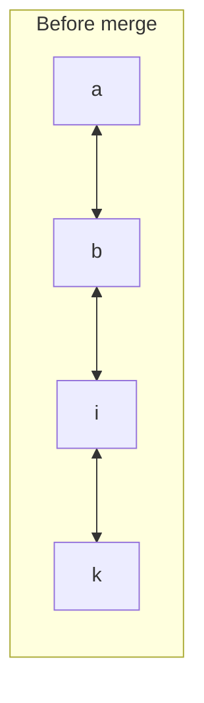
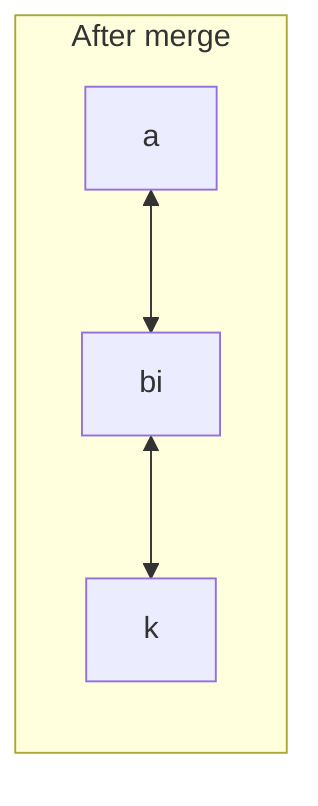
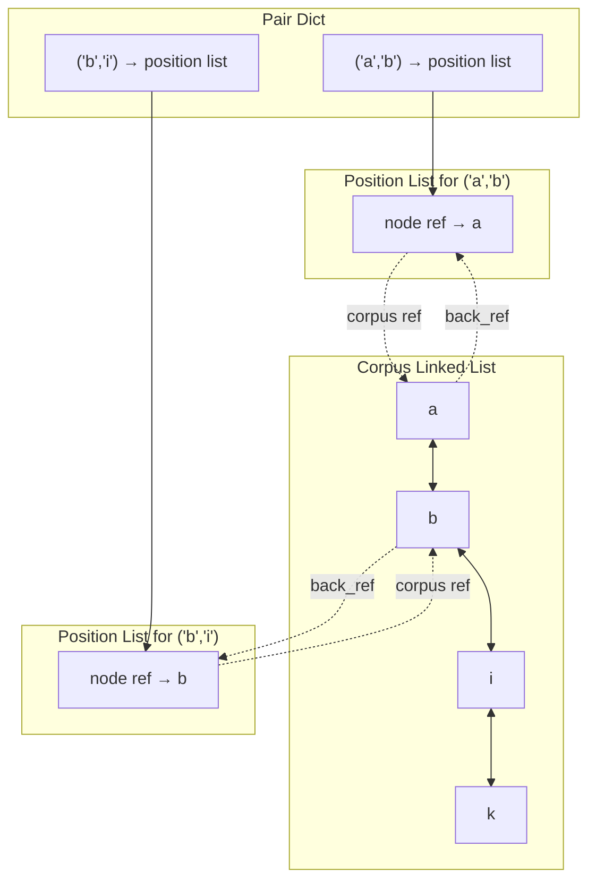
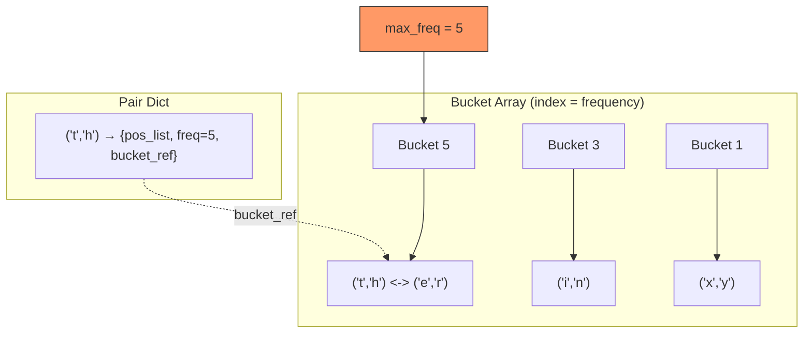
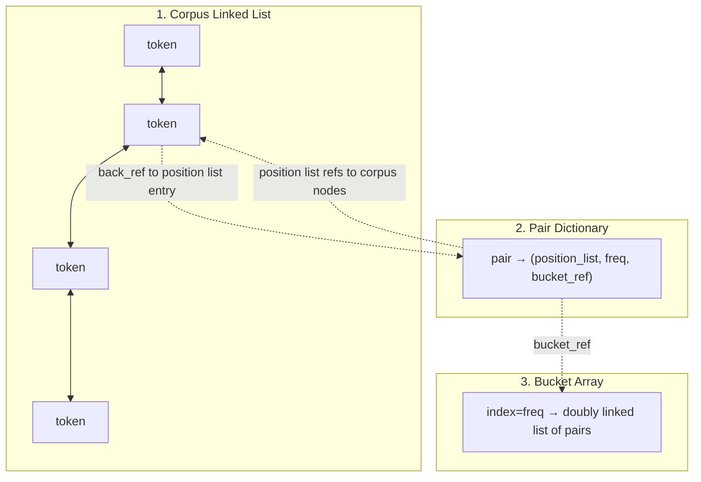

# Efficient BPE — Data Structure Design (Q&A)

This document captures the iterative design of an O(n) BPE algorithm, arrived at through Socratic exploration. It picks up from the open question in `notes.md`: how to avoid rescanning the entire corpus each iteration.

---

## 1. The Core Idea: A Pair Dictionary

**Q: What could we precompute to avoid rescanning the entire corpus each iteration?**

A: Build a dictionary at the start whose keys are all adjacent token pairs found in the text and whose values track where each pair occurs and how often. Then each merge step only touches the affected entries, not the whole corpus.

**Initial design:**
- Key: a token pair, e.g. `("b", "i")`
- Value: `(position_list, count)`

---

## 2. Corpus Representation: Doubly Linked List

**Q: After merging pair `("b", "i")` at some position, how do you find the neighboring tokens (to form new pairs like `("a", "bi")`) in O(1)?**

A: Represent the corpus as a **doubly linked list** of tokens. Given any node, you can reach its neighbors in O(1) and splice nodes together in O(1).

**Q: But don't you need to traverse the list to find each merge site?**

A: No — the pair dictionary's position list stores **direct references (pointers) to the linked list nodes**, not integer positions. You jump straight to each occurrence.

**Q: How do you actually merge? Remove both nodes and insert a new one?**

A: Simpler — just update the value of the first node (e.g. `"b"` becomes `"bi"`) and remove the second node (`"i"`). One removal, one update.





---

## 3. Position Lists: O(1) Removal via Doubly Linked Lists

**Q: The pair `("a", "b")` has 500 occurrences. Only 3 are adjacent to an `"i"` that's being merged. How do you remove just those 3 without scanning all 500?**

A: Make each position list a **doubly linked list** as well. Each corpus node stores a **back-reference** to its entry in the position list. To invalidate an occurrence, follow the back-reference and unlink it in O(1).

### Cross-reference structure

Each corpus node holds:
- `prev` / `next` — neighbors in the corpus linked list
- `back_ref` — pointer to its entry in the relevant position list



---

## 4. Finding the Most Frequent Pair: Bucket Array

**Q: How do you efficiently find the pair with the highest frequency?**

A: Use a **bucket array** indexed by frequency. Bucket `i` holds a doubly linked list of all pairs with frequency `i`. Maintain a `max_freq` variable pointing to the highest non-empty bucket.

**Q: When the top bucket empties after a merge, don't you need to scan downward to find the next non-empty bucket? Isn't that expensive?**

A: **Amortized O(1).** Key observations:
- `max_freq` starts at most `n` (corpus length).
- New pairs created during merges can't have higher frequency than the pairs consumed to form them, so `max_freq` can only stay the same or decrease.
- Total downward scanning across the *entire algorithm* is at most `n`.
- Therefore: amortized O(1) per merge step.

**Q: How do you update a pair's frequency in O(1)?**

A: Each dict entry stores a pointer to its node in the bucket's linked list. To change frequency from `f` to `f-1`: unlink from bucket `f` (O(1) via doubly linked list), insert into bucket `f-1` (O(1) by index).



---

## 5. Complete Data Structure Summary



**Per corpus node:**
| Field | Purpose |
|-------|---------|
| `value` | The token string |
| `prev`, `next` | Neighbors in corpus |
| `back_ref` | Pointer to this node's entry in a position list |

**Per dict entry (keyed by token pair):**
| Field | Purpose |
|-------|---------|
| `position_list` | Doubly linked list of refs to corpus nodes |
| `count` | Number of occurrences |
| `bucket_ref` | Pointer to this pair's node in the bucket array |

**Bucket array:**
| Field | Purpose |
|-------|---------|
| `buckets[i]` | Doubly linked list of all pairs with frequency `i` |
| `max_freq` | Pointer to highest non-empty bucket |

---

## 6. Single Merge Step Walkthrough

To merge the most frequent pair, e.g. `("b", "i")`:

1. **Find max pair:** read `buckets[max_freq]` — O(1).
2. **For each occurrence** (via position list, `m` occurrences total):
   a. Follow the corpus node ref to the `"b"` node.
   b. Update `"b"` node's value to `"bi"`.
   c. Remove the `"i"` node from the corpus linked list.
   d. **Left neighbor update:** if `"b"` has a `prev` node (say `"a"`):
      - Remove `("a", "b")` entry from its position list via back-ref — O(1).
      - Decrement `("a", "b")` frequency; move it to the lower bucket — O(1).
      - Add `("a", "bi")` to the dict (or update if exists) — O(1).
   e. **Right neighbor update:** if `"i"` had a `next` node (say `"k"`):
      - Remove `("i", "k")` entry from its position list via back-ref — O(1).
      - Decrement `("i", "k")` frequency; move it to the lower bucket — O(1).
      - Add `("bi", "k")` to the dict (or update if exists) — O(1).
3. **Remove** the `("b", "i")` entry from the dict and its bucket.
4. **Update** `max_freq` if the top bucket is now empty (scan down).

**Cost per merge step:** O(m) where m = occurrences of the merged pair.

---

## 7. Total Time Complexity: O(n)

**The critical insight:**

Each merge removes exactly `m` nodes from the corpus. A node, once removed, is never removed again. Therefore:

```
m_1 + m_2 + ... + m_V <= n - 1
```

The total merge work across ALL V steps is bounded by the corpus size, not `V * n`.

Add the amortized O(n) total cost of max-finding (since `max_freq` can only decrease and starts at most `n`).

**Total: O(n)** — independent of the number of merges V.

---

## 8. Lessons Learned

1. **The doubly-linked-list + back-reference pattern** is a general technique: whenever you need O(1) removal of a specific element from a collection, use a doubly linked list and store a back-reference to the node from wherever you discover which element to remove.

2. **Bucket arrays** exploit integer-valued keys. When values change by small increments (here, frequency changes by 1), moving between buckets is O(1).

3. **Amortized analysis** reveals the true cost. Any single step might scan many empty buckets, but the total scanning across the whole algorithm is bounded. Similarly, individual merges vary in cost, but total removals are bounded by corpus size.

4. **The sum-of-work argument**: when each item can only be "processed" (removed) once, the total work across all steps is bounded by the number of items, regardless of how many steps there are.
